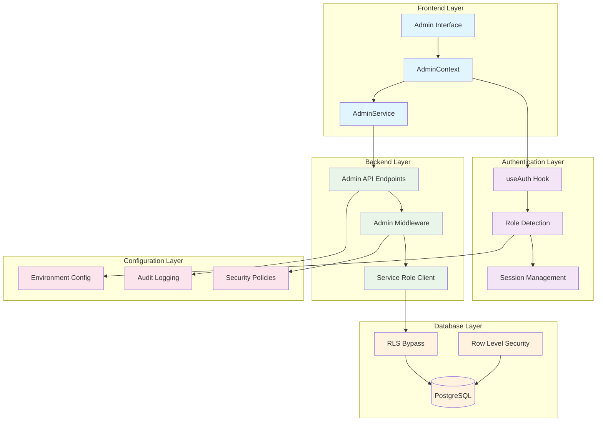
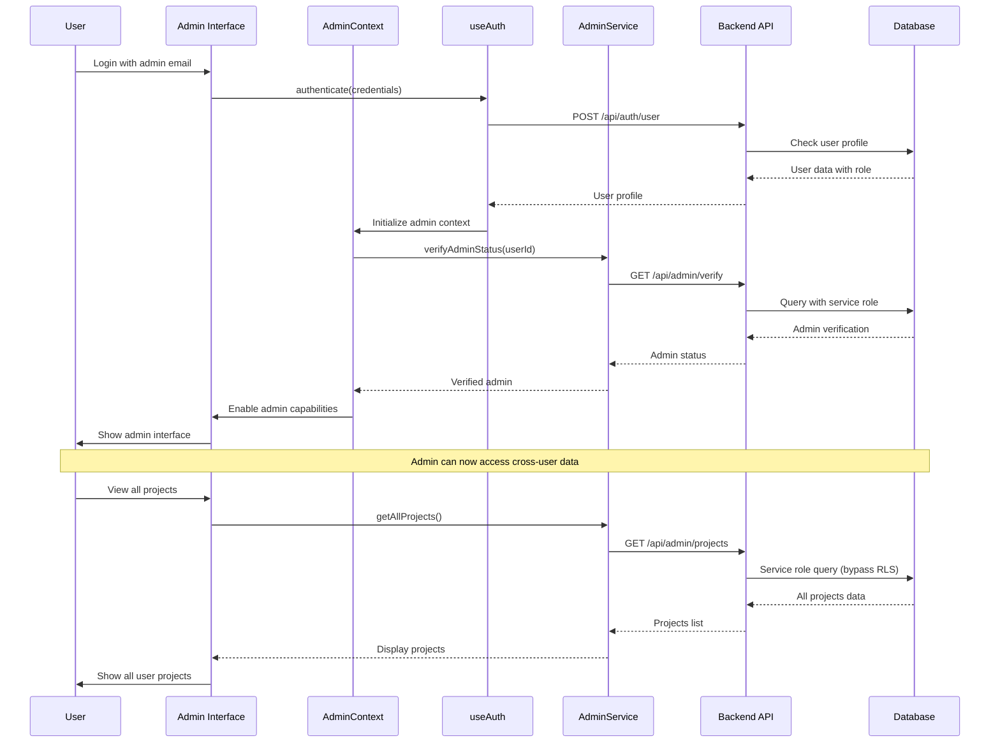
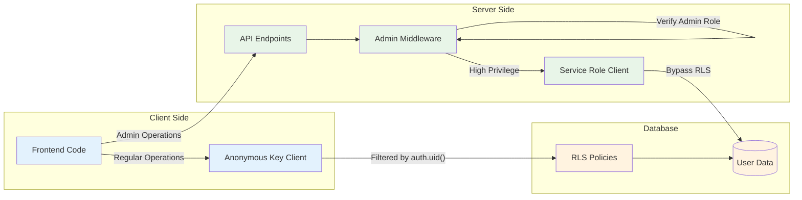
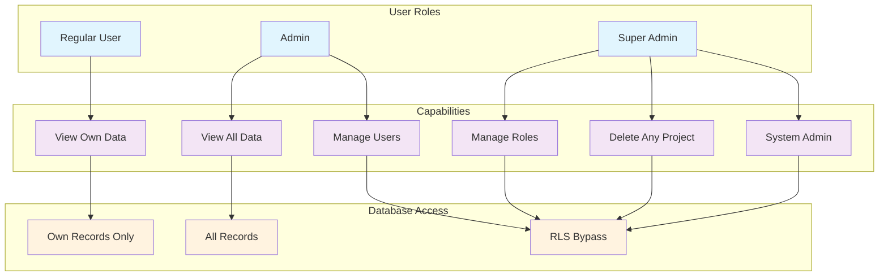
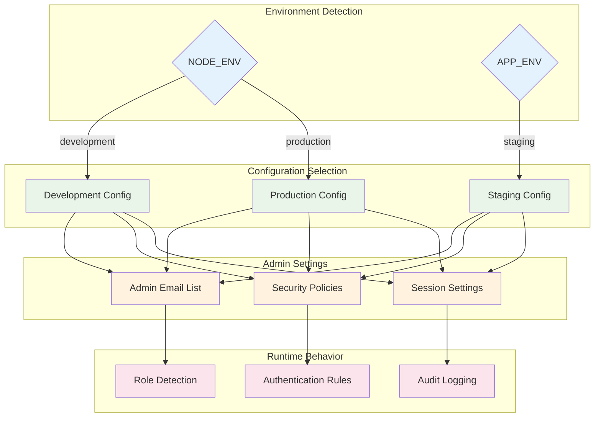
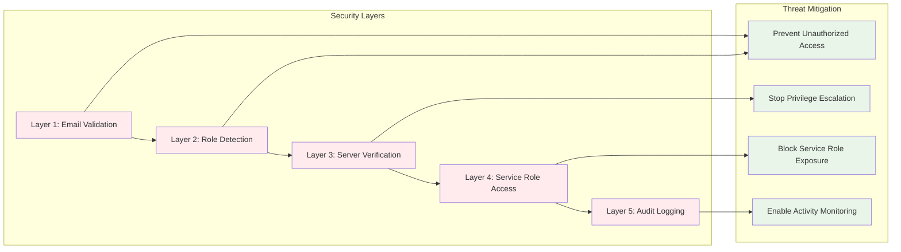
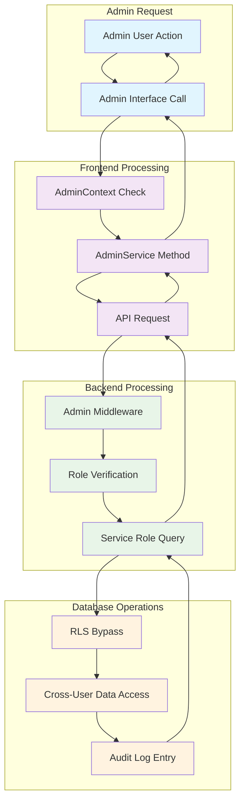

# Admin System Architecture Diagram

## High-Level System Architecture

## Admin Authentication Flow

## Service Role Architecture

## Role-Based Access Control

## Environment Configuration Flow

## Security Layers

## Data Flow: Admin Operations

This architectural diagram system provides a comprehensive visual representation of how the admin system components interact, from the high-level architecture down to the detailed security layers and data flows.