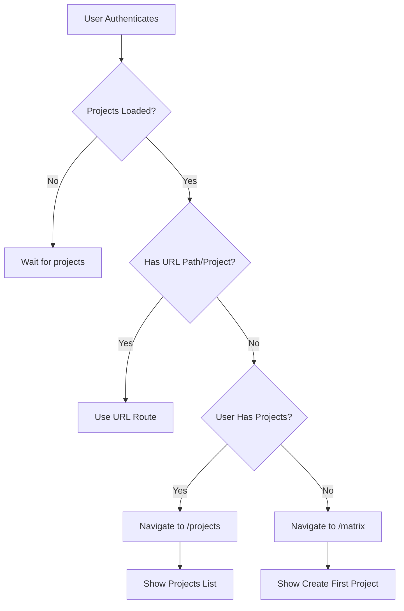

# Design: Default Route for Authenticated Users with Existing Projects

## Problem Statement

**Current Behavior**: When a user logs into the system with existing projects, they land on the Matrix page which shows a "No Project Selected" empty state, requiring manual navigation to the Projects page.

**Desired Behavior**: Users with existing projects should see their projects list as the first screen after authentication, providing immediate context and faster access to their work.

## Requirements

### Functional Requirements

1. **FR-1**: On initial authentication, check if user has existing projects
2. **FR-2**: If user has projects, navigate to `/projects` page by default
3. **FR-3**: If user has no projects, show current "Create Your First Project" experience
4. **FR-4**: Preserve existing URL-based routing and project restoration logic
5. **FR-5**: Don't interfere with direct URL navigation (e.g., user bookmarks specific project)

### Non-Functional Requirements

1. **NFR-1**: Route decision must complete within 2 seconds of authentication
2. **NFR-2**: No breaking changes to existing routing behavior
3. **NFR-3**: Maintain browser history integrity (back button works correctly)
4. **NFR-4**: Support both fresh login and page refresh scenarios

## Current System Analysis

### Authentication Flow
```
App.tsx
└── AppProviders
    └── AppWithAuth
        ├── AuthenticationFlow (handles auth state)
        └── MainApp (renders after auth success)
            └── AppLayout
                └── PageRouter (renders current page)
```

### Routing Architecture

**Components Involved**:
- `MainApp.tsx`: Core app shell, coordinates navigation
- `PageRouter.tsx`: Route rendering logic, handles page-specific redirects
- `useBrowserHistory.ts`: URL sync and project restoration
- `NavigationContext.tsx`: Centralized page state management
- `ProjectContext.tsx`: Project state and loading logic

**Current Default Route**: `matrix` (home page)

**Route Flow**:
1. User authenticates → `handleAuthSuccess()` in `UserContext`
2. `MainApp` renders with `currentPage = 'matrix'` (default)
3. `PageRouter` renders Matrix page
4. Matrix page shows "No Project Selected" empty state
5. User clicks "Go to Projects" → `onPageChange('projects')`

### Project Loading Logic

**Location**: `ProjectContext.tsx` (via `useProject` hook)
- Projects loaded via `ProjectRepository.getUserOwnedProjects(userId)`
- Real-time subscription via `ProjectRepository.subscribeToProjects()`
- Projects stored in context state `projects: Project[]`

## Proposed Solution

### Design Approach: Post-Authentication Route Selection

**Strategy**: Implement intelligent default route selection based on user's project count immediately after authentication completes.

### Architecture Changes

#### 1. Enhanced NavigationContext

**Location**: `src/contexts/NavigationContext.tsx`

**Current**:
```typescript
const [currentPage, setCurrentPage] = useState<string>('matrix')
```

**Proposed**:
```typescript
const [currentPage, setCurrentPage] = useState<string | null>(null) // null = not yet determined
const [hasSetInitialRoute, setHasSetInitialRoute] = useState(false)
```

**New Method**:
```typescript
const setInitialRoute = (userHasProjects: boolean, urlHasPath: boolean) => {
  if (hasSetInitialRoute) return // Only set once per session

  if (urlHasPath) {
    // User navigated to specific URL, respect it
    return
  }

  const route = userHasProjects ? 'projects' : 'matrix'
  setCurrentPage(route)
  setHasSetInitialRoute(true)
}
```

#### 2. Post-Auth Route Determination

**Location**: `src/components/app/MainApp.tsx`

**Implementation**:
```typescript
import { useEffect } from 'react'

export default function MainApp({ currentUser, onLogout }: MainAppProps) {
  const { currentPage, handlePageChange, setInitialRoute } = useNavigation()
  const { currentProject, projects } = useProject()

  // Determine initial route after projects load
  useEffect(() => {
    // Only run once when we have user data and projects have loaded
    if (!currentUser || projects === null) return

    // Check if user navigated to specific URL
    const urlParams = new URLSearchParams(window.location.search)
    const hasProjectInUrl = urlParams.has('project')
    const hasSpecificPath = window.location.pathname !== '/'

    const userHasProjects = projects.length > 0

    setInitialRoute(userHasProjects, hasProjectInUrl || hasSpecificPath)
  }, [currentUser?.id, projects, setInitialRoute])

  // ... rest of component
}
```

#### 3. Project Context Enhancement

**Location**: `src/contexts/ProjectContext.tsx`

**Current**:
```typescript
const [projects, setProjects] = useState<Project[]>([])
```

**Proposed**:
```typescript
const [projects, setProjects] = useState<Project[] | null>(null) // null = loading, [] = no projects, [...] = has projects
const [projectsLoaded, setProjectsLoaded] = useState(false)
```

**Loading Logic**:
```typescript
useEffect(() => {
  if (!currentUser?.id) {
    setProjects(null)
    setProjectsLoaded(false)
    return
  }

  const unsubscribe = ProjectRepository.subscribeToProjects(
    (loadedProjects) => {
      setProjects(loadedProjects || [])
      setProjectsLoaded(true)
    },
    currentUser.id
  )

  return unsubscribe
}, [currentUser?.id])
```

### Routing Decision Logic



### Edge Cases Handled

| Scenario | Behavior | Rationale |
|----------|----------|-----------|
| Direct URL with project ID | Respect URL, restore project | User bookmarked specific project |
| Direct URL to specific page | Respect URL, load that page | User bookmarked specific feature |
| Fresh login, has projects | Route to `/projects` | Show user their work immediately |
| Fresh login, no projects | Route to `/matrix` | Show project creation flow |
| Page refresh on Matrix | Maintain current page | Don't disrupt user workflow |
| Project creation completes | Navigate to Matrix with new project | Existing behavior preserved |

## Implementation Plan

### Phase 1: Context Enhancements
**Files**:
- `src/contexts/NavigationContext.tsx`
- `src/contexts/ProjectContext.tsx`

**Changes**:
1. Add `null` state for initial route determination in NavigationContext
2. Add `setInitialRoute()` method to NavigationContext
3. Change projects state to `Project[] | null` in ProjectContext
4. Add `projectsLoaded` boolean to ProjectContext
5. Export `projectsLoaded` from ProjectContext hook

**Validation**:
- No breaking changes to existing consumers
- Context hooks still return expected types
- TypeScript compilation passes

### Phase 2: Route Determination Logic
**Files**:
- `src/components/app/MainApp.tsx`

**Changes**:
1. Import `setInitialRoute` from NavigationContext
2. Import `projectsLoaded` from ProjectContext
3. Add `useEffect` for post-auth route determination
4. Handle URL path and query parameter detection
5. Call `setInitialRoute()` with correct parameters

**Validation**:
- Fresh login with projects → routes to `/projects`
- Fresh login without projects → routes to `/matrix`
- Direct URLs are respected
- No infinite loops or race conditions

### Phase 3: Loading State UX
**Files**:
- `src/components/app/MainApp.tsx`
- `src/components/layout/PageRouter.tsx` (if needed)

**Changes**:
1. Show loading indicator while `currentPage === null`
2. Prevent rendering PageRouter until route determined
3. Ensure smooth transition (no flash of wrong page)

**Validation**:
- No flash of Matrix page before redirect
- Loading indicator shows during route determination
- Transition is visually smooth

### Phase 4: Testing & Validation

**Test Scenarios**:
1. ✅ Fresh login with existing projects → lands on `/projects`
2. ✅ Fresh login without projects → lands on `/matrix`
3. ✅ Direct URL to `/roadmap?project=abc` → restores project and shows roadmap
4. ✅ Direct URL to `/projects` → shows projects page
5. ✅ Page refresh on Matrix page → stays on Matrix
6. ✅ Create project via AI Starter → navigates to Matrix with project
7. ✅ Browser back button → navigates to previous page correctly
8. ✅ Logout/login cycle → route logic runs again correctly

**Performance Validation**:
- Route determination completes < 2 seconds
- No additional database queries
- No delays in authentication flow

## API Changes

### NavigationContext

**New Exports**:
```typescript
interface NavigationContextType {
  currentPage: string | null // Changed: was always string
  handlePageChange: (page: string) => void
  setInitialRoute: (userHasProjects: boolean, urlHasPath: boolean) => void // New
}
```

### ProjectContext

**Changed Exports**:
```typescript
interface ProjectContextType {
  projects: Project[] | null // Changed: null = loading, [] = no projects
  projectsLoaded: boolean // New
  // ... existing exports
}
```

## Rollback Strategy

### Immediate Rollback
If critical issues arise:
1. Revert `NavigationContext` to always return `'matrix'` as default
2. Remove route determination logic from `MainApp`
3. Restore previous behavior (always start on Matrix page)

### Gradual Rollback
If minor issues found:
1. Add feature flag: `ENABLE_SMART_DEFAULT_ROUTE`
2. Keep new code but disable via flag
3. Fix issues, re-enable flag
4. Remove flag once stable

## Monitoring & Metrics

**Success Metrics**:
- Time to first meaningful interaction (TTFMI): Should decrease by 1-2 seconds
- User navigation paths: More users stay on Projects page vs clicking "Go to Projects"
- Bounce rate on Matrix empty state: Should decrease significantly

**Error Metrics**:
- Route determination failures: Track when `setInitialRoute` errors
- Infinite loop detection: Monitor route change frequency
- Project loading failures: Track when projects don't load before timeout

## Alternative Approaches Considered

### Alternative 1: Always Route to Projects
**Approach**: Every authenticated user lands on `/projects` page

**Pros**:
- Simple implementation
- Consistent experience

**Cons**:
- Bad UX for new users without projects
- Breaks existing Matrix-first mental model
- Requires two navigations for new users (Projects → Matrix)

**Verdict**: ❌ Rejected - poor experience for new users

### Alternative 2: Modal Overlay on Matrix
**Approach**: Show projects list as modal on Matrix page

**Pros**:
- No routing changes needed
- Works with existing architecture

**Cons**:
- Adds UI complexity
- Doesn't solve core problem (Matrix empty state)
- Modal dismissal loses context

**Verdict**: ❌ Rejected - doesn't fundamentally improve UX

### Alternative 3: Persistent Last Page (Selected)
**Approach**: Remember user's last visited page, route there on login

**Pros**:
- Respects user workflow
- Can combine with smart default

**Cons**:
- Requires localStorage persistence
- Complex state management
- May surprise users who expect consistency

**Verdict**: ⚠️ Future enhancement - good for phase 2

## Security Considerations

**Authentication Race Conditions**:
- ✅ Route determination only runs after authentication completes
- ✅ Projects loaded via authenticated client (RLS enforced)
- ✅ No project data exposed before authentication

**URL Manipulation**:
- ✅ Project restoration validates user ownership (RLS)
- ✅ Invalid project IDs gracefully handled
- ✅ No sensitive data in URL parameters

**Session Persistence**:
- ✅ No PII stored in route logic
- ✅ Project IDs already in URL (existing behavior)
- ✅ No new security vectors introduced

## Performance Considerations

**Database Impact**:
- ✅ No additional queries (projects already loaded for app functionality)
- ✅ Real-time subscription already active
- ✅ Route determination uses in-memory data only

**Rendering Performance**:
- ✅ Route determination in single useEffect (O(1))
- ✅ No additional re-renders introduced
- ✅ Loading state prevents unnecessary page renders

**Bundle Size**:
- ✅ No new dependencies
- ✅ ~50 lines of new code
- ✅ Negligible impact on bundle

## Documentation Updates

**User-Facing**:
- Update onboarding docs to reflect new default behavior
- Update FAQ: "Why do I see Projects page on login?"

**Developer-Facing**:
- Document NavigationContext API changes
- Document ProjectContext API changes
- Add architecture diagram to routing docs
- Update testing documentation with new scenarios

## Success Criteria

**Phase 1 (Context Changes)**:
- ✅ TypeScript compilation passes
- ✅ Existing consumers work without changes
- ✅ Unit tests pass

**Phase 2 (Route Logic)**:
- ✅ Fresh login with projects → `/projects`
- ✅ Fresh login without projects → `/matrix`
- ✅ Direct URLs respected
- ✅ No console errors or warnings

**Phase 3 (UX Polish)**:
- ✅ No flash of wrong page
- ✅ Smooth loading transition
- ✅ Loading indicator clear and brief

**Phase 4 (Validation)**:
- ✅ All 8 test scenarios pass
- ✅ Route determination < 2 seconds
- ✅ Browser back button works correctly
- ✅ No memory leaks or infinite loops

## Timeline Estimate

**Phase 1**: 1-2 hours (context changes)
**Phase 2**: 2-3 hours (route logic + debugging)
**Phase 3**: 1-2 hours (loading UX)
**Phase 4**: 2-3 hours (testing & validation)

**Total**: 6-10 hours (1-2 days of focused work)

## Conclusion

This design provides a **minimal, non-breaking enhancement** to the routing system that significantly improves UX for returning users while preserving existing behavior for edge cases and direct navigation.

**Key Benefits**:
- Faster time to meaningful interaction for users with projects
- No breaking changes to existing routing logic
- Graceful handling of all edge cases
- Clear rollback strategy if issues arise
- Foundation for future routing enhancements (persistent last page)

**Implementation Risk**: **Low**
- Isolated changes to context layers
- Existing routing logic untouched
- Comprehensive test coverage planned
- Clear success criteria defined
